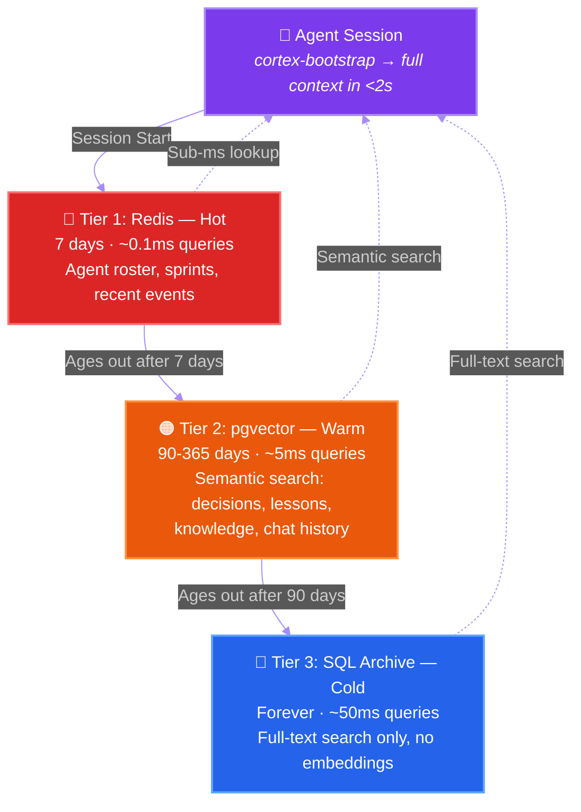
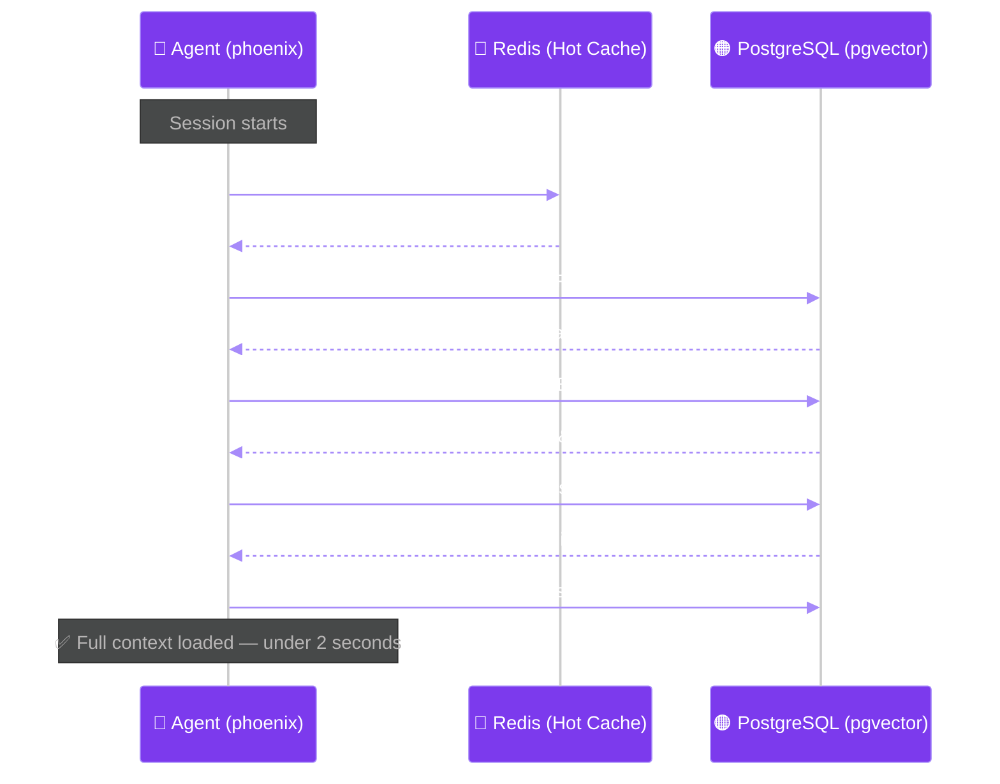
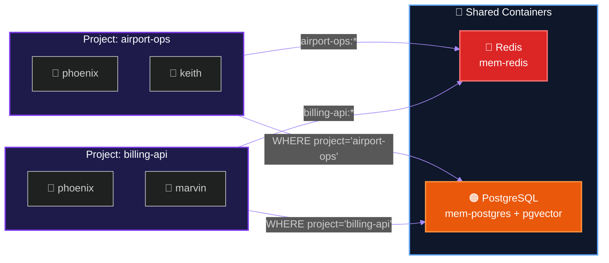

# Agent Memory

**Persistent 3-tier memory for AI coding agents — Redis, pgvector, SQL archive**

> Your AI coding agent forgets everything between sessions. Every decision, every lesson, every architectural choice — gone. Agent Memory fixes that.

[](LICENSE)
[]()
[]()
[]()

---

## The Problem

Every AI coding session starts cold. No memory of yesterday's decisions. No recall of last week's architecture changes. No awareness that the team already tried and rejected approach X three sprints ago.

The context window can hold a lot — but it can't hold a month of work. And file-based memory (markdown files in a `.memory/` folder) doesn't scale. You can't ask a markdown file *"what did we decide about the auth architecture?"* and get a meaningful answer.

I built Agent Memory to solve this. It's the memory layer I run across 6 projects at [TAM Platform](https://github.com/amadmalik), where multiple AI agents collaborate on airport management software.

## The Architecture

Three tiers. Data flows down as it ages. Nothing is ever deleted.



| Tier | Store | Retention | Search | Cost |
|------|-------|-----------|--------|------|
| **Hot** | Redis | 7 days | Key lookup | Lowest |
| **Warm** | PostgreSQL + pgvector | 90-365 days | Semantic (vector) + full-text | Medium |
| **Cold** | PostgreSQL archive tables | Forever | Full-text only | Lowest (no embeddings) |

## Quick Start

**Prerequisites:** Podman (or Docker) installed. That's it.

```bash
# Clone
git clone https://github.com/amadmalik/agent-memory.git
cd agent-memory

# Setup — starts Redis + PostgreSQL containers, creates DB, applies schema
bash setup.sh

# Test it — load full context for an agent named "phoenix"
bash scripts/cortex-bootstrap phoenix
```

You should see output like:

```
# Agent Memory — Context for phoenix
Generated: 2026-03-25 14:30:00 | Project: myproject

## Team Roster
Name             Role                 Model
---------------  --------------------  --------------------
phoenix          backend-specialist    claude-opus-4

## Active Sprints
(No active sprints yet)

## Recent Decisions (last 7 days)
(No data)

## Recent Lessons (last 14 days)
(No data)

Agent Memory bootstrap complete. You are phoenix on project myproject.
```

That was less than 60 seconds. Your agent now has persistent memory.

### What Happens Under the Hood



## What's Inside

```
agent-memory/
├── README.md
├── LICENSE                     (MIT)
├── setup.sh                    One-shot setup script
├── schema.sql                  Memory tables:
│                                 knowledge, messages, decisions, lessons,
│                                 agent_sessions, agents, sprints,
│                                 archive_messages, archive_decisions,
│                                 archive_lessons, retention_config
├── scripts/
│   ├── _cortex_lib.sh          Shared library (project config, container detection)
│   ├── cortex-bootstrap        Session start — loads full team context
│   ├── cortex-search           Semantic search across all memory
│   ├── cortex-history          Chat history query
│   ├── cortex-state            Sprint + summary display
│   ├── cortex-roster           Agent roster
│   └── cortex-diagnose         Environment health check
├── examples/
│   ├── single-agent-memory.md  Using memory with one agent
│   └── team-memory.md          Sharing memory across agents
├── skills/
│   └── agent-memory.md         Drop-in Claude Code skill
└── docs/
    ├── schema-reference.md     Table-by-table documentation
    └── configuration.md        All env vars and config options
```

## How It Works

### Session Start: `cortex-bootstrap`

Every agent session begins by running one command:

```bash
bash scripts/cortex-bootstrap <agent_name>
```

This pulls the agent's full context in a single call:
- **Team Roster** — who is registered and their roles
- **Active Sprints** — current goals and status
- **Your Tasks** — assigned work items
- **Recent Decisions** — team decisions from the last 7 days
- **Recent Lessons** — patterns learned from the last 14 days
- **Recent Activity** — event log from the last 3 days
- **Session Log** — records this session start for other agents to see

One command. Under 2 seconds. Full awareness.

### Semantic Search: `cortex-search`

This is where it gets interesting. Not keyword grep — actual semantic search.

```bash
bash scripts/cortex-search "what did we decide about the auth architecture"
```

This searches across decisions, lessons, knowledge, and messages using pgvector embeddings (2048 dimensions via NVIDIA NV-EmbedQA, free tier on OpenRouter). It finds things by meaning, not just matching words.

### Chat History: `cortex-history`

Full conversation history, queryable:

```bash
# Last 10 messages from phoenix
bash scripts/cortex-history --agent phoenix --last 10

# Everything since Monday
bash scripts/cortex-history --since 2026-03-24
```

### Environment Check: `cortex-diagnose`

Self-service health check. Verifies containers, database connectivity, schema, Redis streams:

```bash
bash scripts/cortex-diagnose
```

## The Schema

11 tables. 6 active, 3 archive, 1 config, 1 session tracking.

**Active tables** (Tier 2 — with embeddings where applicable):
- `agents` — agent registry (name, role, model, project)
- `sprints` — sprint tracking (goals, status, dates)
- `knowledge` — embedded document chunks for semantic search
- `messages` — full chat history with embeddings
- `decisions` — architectural decisions with embeddings
- `lessons` — learned patterns with embeddings

**Archive tables** (Tier 3 — no embeddings, forever retention):
- `archive_messages`
- `archive_decisions`
- `archive_lessons`

**System tables:**
- `agent_sessions` — per-agent session log
- `retention_config` — configurable retention windows per table

Every table has a `project` column. Multiple projects share one database, fully isolated.

## Configuration

| Variable | Default | Purpose |
|----------|---------|---------|
| `CORTEX_PROJECT` | `myproject` | Project namespace for DB + Redis isolation |
| `CORTEX_PG_PORT` | `5432` | PostgreSQL port |
| `CORTEX_REDIS_PORT` | `6379` | Redis port |
| `CORTEX_PG_CONTAINER` | `mem-postgres` | PostgreSQL container name |
| `CORTEX_REDIS_CONTAINER` | `mem-redis` | Redis container name |
| `OPENROUTER_API_KEY` | — | For semantic search embeddings (optional) |

If `OPENROUTER_API_KEY` is not set, cortex-search falls back to PostgreSQL full-text search. Semantic search is better, but full-text still works.

## Works With

Agent Memory is model-agnostic and tool-agnostic. Any tool that can run bash scripts can use it.

| Tool | Status | Notes |
|------|--------|-------|
| **Claude Code** | Fully tested | Native bash execution |
| **Codex** | Fully tested | May need PATH fix in sandbox — see docs |
| **Gemini CLI** | Fully tested | Native bash execution |
| **Cursor** | Works | Via terminal integration |
| **GitHub Copilot** | Works | Via terminal integration |

## Multi-Project Support

One Redis + one PostgreSQL instance serves all your projects. Data is isolated by project namespace.



- **PostgreSQL:** `project` column on every table. All queries filter by project.
- **Redis:** Key prefix `{project}:`. Stream named `{project}:cortex:events`.
- **CLI:** `CORTEX_PROJECT` env var controls which project you're targeting.

```bash
# Project A
CORTEX_PROJECT=airport-ops bash scripts/cortex-bootstrap phoenix

# Project B (same containers, different data)
CORTEX_PROJECT=billing-api bash scripts/cortex-bootstrap phoenix
```

## What This Is Not

- **Not an agent framework.** This doesn't orchestrate agents or manage workflows. It gives agents memory. What they do with it is up to them (and you).
- **Not a vector database product.** It uses pgvector as one component in a 3-tier system.
- **Not tied to any model or provider.** Claude, GPT, Gemini, Llama — if it can run bash, it can remember.

## Part of Agent Cortex

Agent Memory is **Piece 1** of [Agent Cortex](https://github.com/amadmalik/agent-cortex) — a complete multi-agent collaboration system. Each piece works standalone.

| Piece | Repo | What It Does |
|-------|------|-------------|
| **1. Memory** | **You are here** | Persistent 3-tier memory |
| 2. Telepathic Link | [agent-telepathy](https://github.com/amadmalik/agent-telepathy) | Shared awareness via Redis Streams |
| 3. Handoffs | [agent-handoffs](https://github.com/amadmalik/agent-handoffs) | Structured work transfers |
| 4. Roles | [agent-roles](https://github.com/amadmalik/agent-roles) | Domain boundaries and steering |
| 5. Retention | [agent-retention](https://github.com/amadmalik/agent-retention) | Data lifecycle management |
| 6. Multi-Tool | [agent-multimodel](https://github.com/amadmalik/agent-multimodel) | Cross-tool agent teams |
| 7. Full Cortex | [agent-cortex](https://github.com/amadmalik/agent-cortex) | Everything assembled |

## Lessons From Production

This system runs across 6 projects. Here is what we learned the hard way:

1. **Schema drift is the #1 source of bugs.** Projects set up at different times end up with different table schemas. Always re-apply `schema.sql` when updating.
2. **Every CLI script needs `--help`.** AI agents explore tools by trying `--help` first. If your script doesn't handle it, the agent runs the actual operation by accident.
3. **PostgreSQL is essential. Redis is optional.** The system degrades gracefully without Redis — queries go directly to PostgreSQL. Without PostgreSQL, nothing works.
4. **File-based memory doesn't survive the first month.** Markdown files are fine for a solo agent on a weekend project. For anything beyond that, you need a database.
5. **BSD sed on macOS breaks GNU sed scripts.** We use `awk` for all portable text processing. Save yourself the debugging.

## License

MIT. Use it, modify it, sell it, whatever. Just don't blame me if your agent remembers something you wish it hadn't.

## Author

**Amad Malik** — CTO at Atos, Chief AI Officer at Adaptech AI. I build multi-agent AI systems for aviation. Agent Cortex is what happens when you run 4+ AI agents on the same codebase and get tired of them forgetting everything.

[LinkedIn](https://www.linkedin.com/in/amadmalik/) · [GitHub](https://github.com/amadmalik) · [The AIr Mobility Show](https://www.youtube.com/@TheAIrMobilityShow)

---

*Star this repo if it's useful. Open an issue if it's not.*
