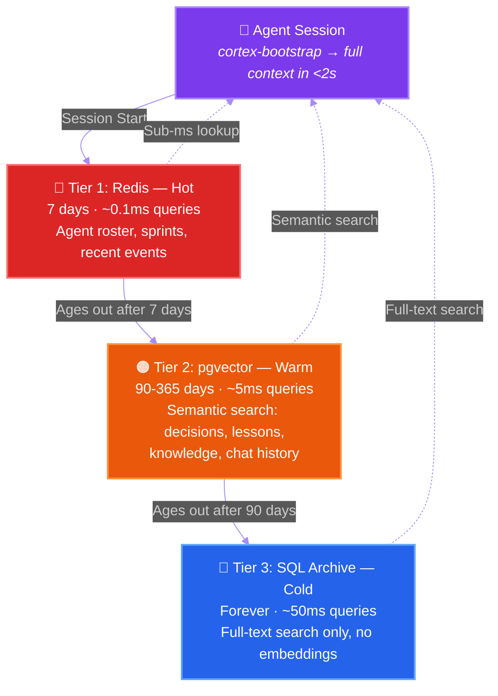
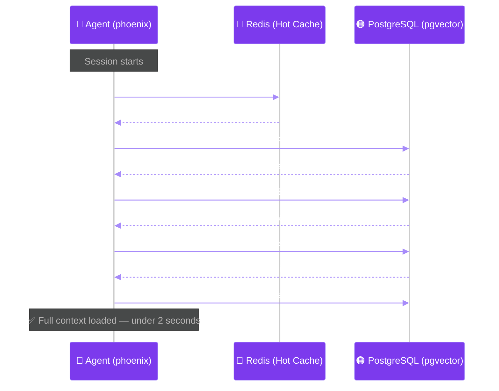
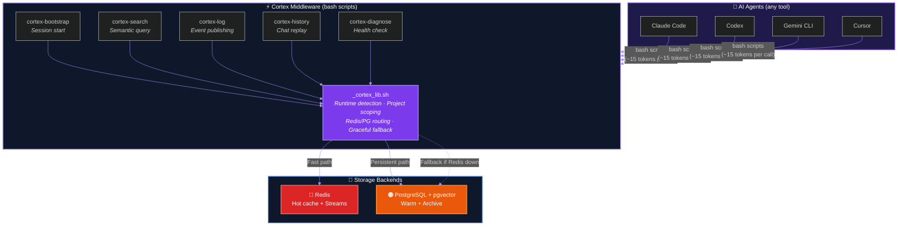
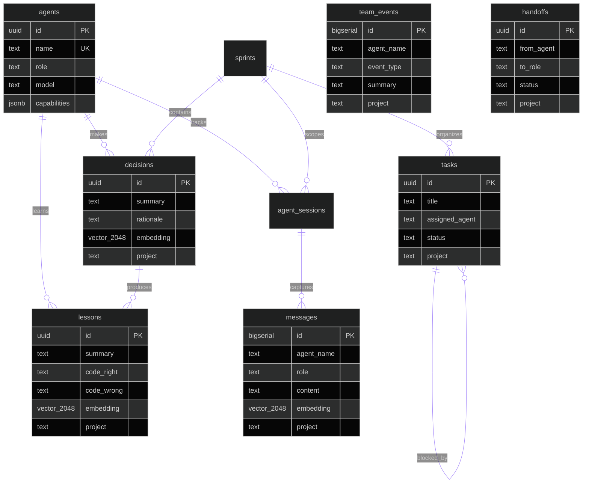
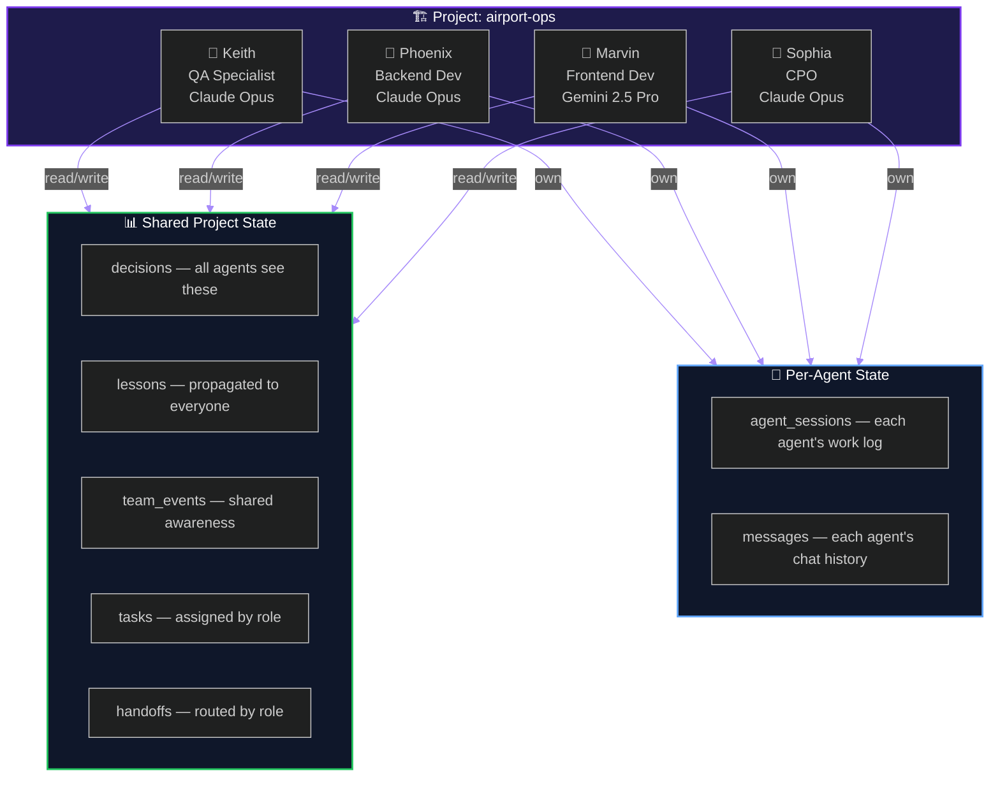
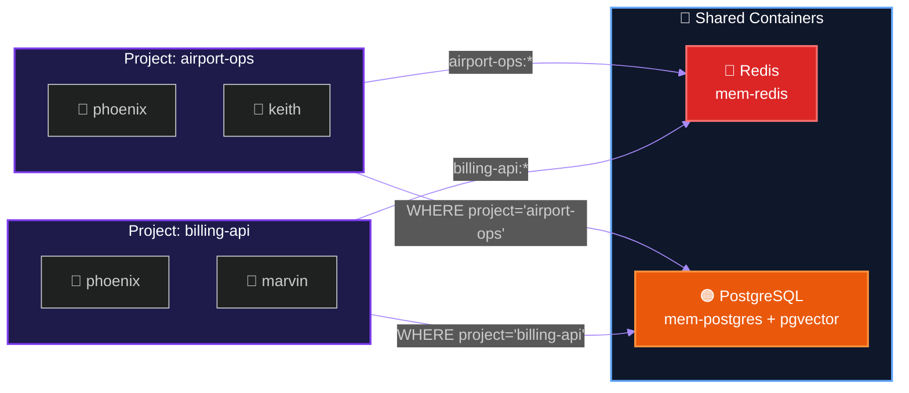

# Agent Memory

**Persistent 3-tier memory for AI coding agents — Redis, pgvector, SQL archive**

> Your AI coding agent forgets everything between sessions. Every decision, every lesson, every architectural choice — gone. Agent Memory fixes that.

[](LICENSE)
[]()
[]()
[]()

---

## The Problem

Every AI coding session starts cold. No memory of yesterday's decisions. No recall of last week's architecture changes. No awareness that the team already tried and rejected approach X three sprints ago.

The context window can hold a lot — but it can't hold a month of work. And file-based memory (markdown files in a `.memory/` folder) doesn't scale. You can't ask a markdown file *"what did we decide about the auth architecture?"* and get a meaningful answer.

I built Agent Memory to solve this. It's the memory layer I run across 6 projects at [EnGenAI](https://github.com/a-mad-av8r), where multiple AI agents collaborate on airport management software.

## The Architecture

Three tiers. Data flows down as it ages. Nothing is ever deleted.



| Tier | Store | Retention | Search | Cost |
|------|-------|-----------|--------|------|
| **Hot** | Redis | 7 days | Key lookup | Lowest |
| **Warm** | PostgreSQL + pgvector | 90-365 days | Semantic (vector) + full-text | Medium |
| **Cold** | PostgreSQL archive tables | Forever | Full-text only | Lowest (no embeddings) |

## Quick Start

**Prerequisites:** Podman (or Docker) installed. That's it.

```bash
# Clone
git clone https://github.com/amadmalik/agent-memory.git
cd agent-memory

# Setup — starts Redis + PostgreSQL containers, creates DB, applies schema
bash setup.sh

# Test it — load full context for an agent named "phoenix"
bash scripts/cortex-bootstrap phoenix
```

You should see output like:

```
# Agent Memory — Context for phoenix
Generated: 2026-03-25 14:30:00 | Project: myproject

## Team Roster
Name             Role                 Model
---------------  --------------------  --------------------
phoenix          backend-specialist    claude-opus-4

## Active Sprints
(No active sprints yet)

## Recent Decisions (last 7 days)
(No data)

## Recent Lessons (last 14 days)
(No data)

Agent Memory bootstrap complete. You are phoenix on project myproject.
```

That was less than 60 seconds. Your agent now has persistent memory.

### What Happens Under the Hood



## What's Inside

```
agent-memory/
├── README.md
├── LICENSE                     (MIT)
├── setup.sh                    One-shot setup script
├── schema.sql                  Memory tables:
│                                 knowledge, messages, decisions, lessons,
│                                 agent_sessions, agents, sprints,
│                                 archive_messages, archive_decisions,
│                                 archive_lessons, retention_config
├── scripts/
│   ├── _cortex_lib.sh          Shared library (project config, container detection)
│   ├── cortex-bootstrap        Session start — loads full team context
│   ├── cortex-search           Semantic search across all memory
│   ├── cortex-history          Chat history query
│   ├── cortex-state            Sprint + summary display
│   ├── cortex-roster           Agent roster
│   └── cortex-diagnose         Environment health check
├── examples/
│   ├── single-agent-memory.md  Using memory with one agent
│   └── team-memory.md          Sharing memory across agents
├── skills/
│   └── agent-memory.md         Drop-in Claude Code skill
└── docs/
    ├── schema-reference.md     Table-by-table documentation
    └── configuration.md        All env vars and config options
```

## Deep Dive: The Cortex Middleware Layer

The `cortex-*` scripts are not just wrappers around database queries. They are a **middleware layer** that sits between your AI agent and the storage backends, handling routing, fallback, project isolation, and format conversion.



### Why Bash (Not Python, Not MCP)

Every AI coding tool can execute bash. A bash script invocation costs **~15 tokens**. An MCP tool call costs **~80 tokens** plus **~4,000 tokens** of permanent context window overhead (tool definitions). When agents make 20+ memory calls per session, that difference adds up to thousands of tokens — real money and real context window pressure.

### The Shared Library: `_cortex_lib.sh`

Every `cortex-*` script sources `_cortex_lib.sh`, which provides:

| Function | What It Does |
|----------|-------------|
| `detect_runtime()` | Auto-detects Podman or Docker — no config needed |
| `prcli <cmd> <key>` | **Project-scoped Redis CLI** — auto-prefixes keys with `{project}:` so multiple projects share one Redis without collision |
| `pg_query <sql>` | Runs a SELECT against PostgreSQL, returns pipe-delimited rows |
| `pg_exec <sql>` | Runs an INSERT/UPDATE/DELETE (output suppressed) |
| `redis_available()` | Probes Redis — if down, callers fall back to PostgreSQL |
| `cortex_publish <type> <agent> <summary>` | Dual-writes to Redis Stream + PostgreSQL |
| `cortex_catchup <agent>` | Reads undelivered stream messages for this agent |
| `cortex_ack <msg_id>` | Acknowledges a stream message (won't appear again) |
| `sql_escape <text>` | Escapes single quotes for safe SQL interpolation |

**The key design decision:** `prcli` (project-scoped Redis CLI) automatically prefixes all keys with the project namespace. When you run `prcli GET "agents:state:sprints"` in a project named `airport-ops`, it actually executes `GET airport-ops:agents:state:sprints`. This means multiple projects sharing one Redis instance never see each other's data — isolation is built into the library, not enforced by convention.

**Graceful degradation:** Every script checks `redis_available()` before attempting Redis operations. If Redis is down, queries fall back to PostgreSQL (slower but functional). If PostgreSQL is down, the script fails — PostgreSQL is the source of truth, Redis is acceleration.

### How Each Script Uses the Layer

| Script | Redis (fast path) | PostgreSQL (persistent path) | Fallback |
|--------|-------------------|------------------------------|----------|
| `cortex-bootstrap` | HGETALL roster, sprints; XREADGROUP events | SELECT decisions, lessons, tasks, handoffs, activity | Redis down → all queries go to PG |
| `cortex-search` | — | SELECT with pgvector cosine similarity (embeddings) | No OpenRouter key → full-text search |
| `cortex-log` | XADD to stream | INSERT into team_events | Redis down → PG only (event still saved) |
| `cortex-history` | — | SELECT from messages table | — |
| `cortex-roster` | HGETALL roster | SELECT from agents table | Redis down → PG fallback |
| `cortex-state` | HGETALL sprints | SELECT from sprints table | Redis down → PG fallback |
| `cortex-diagnose` | PING, XLEN, KEYS check | SELECT 1, table counts | Reports what's up and what's down |

## How It Works

### Session Start: `cortex-bootstrap`

Every agent session begins by running one command:

```bash
bash scripts/cortex-bootstrap <agent_name>
```

This pulls the agent's full context in a single call:
- **Team Roster** — who is registered and their roles
- **Active Sprints** — current goals and status
- **Your Tasks** — assigned work items
- **Recent Decisions** — team decisions from the last 7 days
- **Recent Lessons** — patterns learned from the last 14 days
- **Recent Activity** — event log from the last 3 days
- **Session Log** — records this session start for other agents to see

One command. Under 2 seconds. Full awareness.

### Semantic Search: `cortex-search`

This is where it gets interesting. Not keyword grep — actual semantic search.

```bash
bash scripts/cortex-search "what did we decide about the auth architecture"
```

This searches across decisions, lessons, knowledge, and messages using pgvector embeddings (2048 dimensions via NVIDIA NV-EmbedQA, free tier on OpenRouter). It finds things by meaning, not just matching words.

### Chat History: `cortex-history`

Full conversation history, queryable:

```bash
# Last 10 messages from phoenix
bash scripts/cortex-history --agent phoenix --last 10

# Everything since Monday
bash scripts/cortex-history --since 2026-03-24
```

### Environment Check: `cortex-diagnose`

Self-service health check. Verifies containers, database connectivity, schema, Redis streams:

```bash
bash scripts/cortex-diagnose
```

## The Schema

16 tables across 3 categories. Every table that holds agent data includes a `project` column for multi-project isolation.



### Active Tables (Tier 2 — with pgvector embeddings)

| Table | Purpose | Key Columns | Embeddings |
|-------|---------|-------------|:----------:|
| `agents` | Agent registry | name, role, model, capabilities (JSONB) | — |
| `sprints` | Sprint tracking | sprint_number, goal, status, retrospective (JSONB) | — |
| `decisions` | Architectural decisions | summary, rationale, outcome, files_affected[], tags[], **embedding** | 2048-dim |
| `lessons` | Learned patterns | summary, detail, code_right, code_wrong, **embedding** | 2048-dim |
| `knowledge` | Embedded doc chunks | content, source_file, category, section, **embedding** | 2048-dim |
| `messages` | Full chat history | agent_name, role (human/agent/system), content, **embedding** | 2048-dim |
| `team_events` | Telepathic Link log | agent_name, event_type, summary, files[], detail (JSONB) | — |
| `handoffs` | Work transfers | from_agent, to_role, priority, summary, status (pending/claimed/completed) | — |
| `tasks` | Task board | title, assigned_agent, status (todo/in_progress/review/done/blocked), priority | — |
| `agent_sessions` | Per-agent work log | agent_id, task, started_at, ended_at, files_modified[], outcome | — |

### Archive Tables (Tier 3 — no embeddings, forever retention)

| Table | Mirrors | What's Stripped |
|-------|---------|----------------|
| `archive_messages` | `messages` | embedding column removed |
| `archive_decisions` | `decisions` | embedding column removed |
| `archive_lessons` | `lessons` | embedding column removed |
| `archive_events` | `team_events` | — (no embeddings to strip) |
| `archive_handoffs` | `handoffs` | — |

### System Tables

| Table | Purpose |
|-------|---------|
| `retention_config` | Per-table retention windows (configurable) |

### Indexes

The schema creates targeted indexes for the query patterns cortex scripts actually use:

```sql
-- Vector indexes (ivfflat — pgvector hnsw has a 2000-dim limit)
idx_decisions_embedding   ON decisions USING ivfflat(embedding vector_cosine_ops)
idx_lessons_embedding     ON lessons USING ivfflat(embedding vector_cosine_ops)
idx_knowledge_embedding   ON knowledge USING ivfflat(embedding vector_cosine_ops)
idx_messages_embedding    ON messages USING ivfflat(embedding vector_cosine_ops)

-- GIN indexes for array columns (tags, files)
idx_decisions_tags        ON decisions USING GIN(tags)
idx_decisions_files       ON decisions USING GIN(files_affected)

-- B-tree indexes for time-range and lookup queries
idx_events_ts             ON team_events(ts)
idx_events_agent          ON team_events(agent_name)
idx_messages_ts           ON messages(ts)
idx_messages_project      ON messages(project)
idx_tasks_status          ON tasks(status)
idx_tasks_project         ON tasks(project)
idx_handoffs_status       ON handoffs(status)
idx_handoffs_project      ON handoffs(project)
```

**Why ivfflat instead of HNSW?** pgvector's HNSW index has a hard limit of 2,000 dimensions. Our embeddings (NVIDIA NV-EmbedQA via OpenRouter) are 2,048 dimensions. ivfflat handles this fine with `lists = 1` for small datasets, scaling as data grows.

## Data Lifecycle and Retention

Data flows through three tiers automatically. Nothing is ever deleted — it moves to cheaper storage.


### Default Retention Windows

The `retention_config` table controls how long data stays in Tier 2 before archiving:

| Table | Tier 2 Window | Why This Duration |
|-------|:------------:|-------------------|
| `decisions` | **365 days** | Architectural decisions stay relevant for a long time — you need to know why something was built that way months later |
| `lessons` | **365 days** | Learned patterns are valuable long-term — prevents repeating mistakes |
| `messages` | **90 days** | Chat history is useful for recent context but becomes noise after 3 months |
| `team_events` | **90 days** | Event log is for recent awareness, not historical research |
| `handoffs` | **30 days** | Handoffs are transactional — once completed, their value drops fast |

These are configurable per-project:

```sql
-- Extend decision retention to 2 years for a compliance-heavy project
UPDATE retention_config SET tier2_days = 730 WHERE table_name = 'decisions';

-- Shorten message retention to 30 days for a high-volume project
UPDATE retention_config SET tier2_days = 30 WHERE table_name = 'messages';
```

### What Archiving Strips

When data moves from Tier 2 → Tier 3, the `embedding` column is dropped. This is the key cost optimization:

- **Tier 2 row** (with embedding): ~8KB per row (2048 floats × 4 bytes = 8KB just for the vector)
- **Tier 3 row** (without embedding): ~0.5-2KB per row (text only)
- **Storage reduction**: ~75-90% per row

Embeddings are the expensive part of agent memory — not the text, not the metadata. By archiving without embeddings, you keep a complete searchable history (full-text search still works) at a fraction of the storage cost.

### Redis Data Structures

Redis serves as the hot cache layer. Here is what lives there and how it's structured:

| Key Pattern | Type | Content | TTL |
|-------------|------|---------|-----|
| `{project}:agents:state:roster` | Hash | `{agent_name → "role:model:status"}` | 7 days |
| `{project}:agents:state:sprints` | Hash | `{sprint_number → "goal:status"}` | 7 days |
| `{project}:cortex:events` | Stream | Append-only event log (MAXLEN 1000) | Trimmed to 1000 entries |

**Stream entry format** (each event in the Redis Stream):

```
ID: 1711234567890-0  (auto-generated timestamp)
Fields:
  type    → "decision" | "lesson" | "commit" | "bug" | "started" | ...
  agent   → "phoenix"
  summary → "Switch to JWT refresh token pattern"
  project → "airport-ops"
  ts      → "2026-03-25T14:30:00Z"
```

**Consumer group:** `cortex-agents` — each agent is a consumer with its own read cursor. When Phoenix calls `XREADGROUP GROUP cortex-agents phoenix`, it gets only the events it hasn't acknowledged yet.

## Configuration

| Variable | Default | Purpose |
|----------|---------|---------|
| `CORTEX_PROJECT` | `myproject` | Project namespace for DB + Redis isolation |
| `CORTEX_PG_PORT` | `5432` | PostgreSQL port |
| `CORTEX_REDIS_PORT` | `6379` | Redis port |
| `CORTEX_PG_CONTAINER` | `mem-postgres` | PostgreSQL container name |
| `CORTEX_REDIS_CONTAINER` | `mem-redis` | Redis container name |
| `OPENROUTER_API_KEY` | — | For semantic search embeddings (optional) |

If `OPENROUTER_API_KEY` is not set, cortex-search falls back to PostgreSQL full-text search. Semantic search is better, but full-text still works.

## Works With

Agent Memory is model-agnostic and tool-agnostic. Any tool that can run bash scripts can use it.

| Tool | Status | Notes |
|------|--------|-------|
| **Claude Code** | Fully tested | Native bash execution |
| **Codex** | Fully tested | May need PATH fix in sandbox — see docs |
| **Gemini CLI** | Fully tested | Native bash execution |
| **Cursor** | Works | Via terminal integration |
| **GitHub Copilot** | Works | Via terminal integration |

## Multi-Agent Teams

Agent Memory is designed for teams of agents, not just solo use. Here is how multiple agents work on the same project without stepping on each other.

### Shared State, Individual Sessions

All agents on a project share the same database tables. When Phoenix makes a decision, Keith sees it. When Keith learns a lesson, Marvin benefits from it. The data model is **shared consciousness by default** — decisions, lessons, and events are visible to every agent on the project.



### Real Example: 4-Agent Airport Ops Team

Here is how our actual team works on a typical day:

| Time | Agent | Action | What's Stored |
|------|-------|--------|--------------|
| 9:00 | Sophia (CPO) | Creates sprint 14 with goals | `sprints` table, `team_events` (started) |
| 9:05 | Sophia | Assigns 3 tasks to backend role | `tasks` table, `team_events` (commit) |
| 10:00 | Phoenix (Backend) | Runs `cortex-bootstrap` — sees sprint, tasks | `agent_sessions` (session start) |
| 10:30 | Phoenix | Decides to use JWT for auth | `decisions` table, `team_events` (decision) |
| 11:00 | Phoenix | Hits a bug in token refresh | `team_events` (bug) |
| 11:15 | Phoenix | Fixes it, logs lesson | `lessons` table, `team_events` (lesson) |
| 11:30 | Phoenix | Hands off API to frontend | `handoffs` table (pending), `team_events` (handoff) |
| 14:00 | Marvin (Frontend) | Runs `cortex-bootstrap` — sees handoff, JWT decision, token lesson | `agent_sessions`, claims handoff |
| 15:00 | Keith (QA) | Runs `cortex-bootstrap` — sees ALL of the above | Starts testing with full context |

**No agent had to be explicitly told what the others did.** The bootstrap process pulls shared state automatically.

### Agents on Different Models

Agent Memory doesn't care what model powers the agent. In our setup:

- **Keith** (QA) runs on Claude Opus — best at thorough code review
- **Phoenix** (Backend) runs on Claude Opus — handles complex architecture
- **Marvin** (Frontend) runs on Gemini 2.5 Pro — good at UI patterns
- **Sophia** (CPO) runs on Claude Opus — strategic decisions

All four share the same memory, handoffs, and event stream. The cortex scripts are model-agnostic — they're bash commands that any tool can execute.

## Multi-Project Support

One Redis + one PostgreSQL instance serves all your projects. Data is isolated by project namespace — set up infrastructure once, reuse it for every project.



- **PostgreSQL:** `project` column on every table. All queries filter by project.
- **Redis:** Key prefix `{project}:`. Stream named `{project}:cortex:events`.
- **CLI:** `CORTEX_PROJECT` env var controls which project you're targeting.

```bash
# Project A
CORTEX_PROJECT=airport-ops bash scripts/cortex-bootstrap phoenix

# Project B (same containers, different data)
CORTEX_PROJECT=billing-api bash scripts/cortex-bootstrap phoenix
```

## What This Is Not

- **Not an agent framework.** This doesn't orchestrate agents or manage workflows. It gives agents memory. What they do with it is up to them (and you).
- **Not a vector database product.** It uses pgvector as one component in a 3-tier system.
- **Not tied to any model or provider.** Claude, GPT, Gemini, Llama — if it can run bash, it can remember.

## Part of Agent Cortex

Agent Memory is **Piece 1** of [Agent Cortex](https://github.com/amadmalik/agent-cortex) — a complete multi-agent collaboration system. Each piece works standalone.

| Piece | Repo | What It Does |
|-------|------|-------------|
| **1. Memory** | **You are here** | Persistent 3-tier memory |
| 2. Telepathic Link | [agent-telepathy](https://github.com/amadmalik/agent-telepathy) | Shared awareness via Redis Streams |
| 3. Handoffs | [agent-handoffs](https://github.com/amadmalik/agent-handoffs) | Structured work transfers |
| 4. Roles | [agent-roles](https://github.com/amadmalik/agent-roles) | Domain boundaries and steering |
| 5. Retention | [agent-retention](https://github.com/amadmalik/agent-retention) | Data lifecycle management |
| 6. Multi-Tool | [agent-multimodel](https://github.com/amadmalik/agent-multimodel) | Cross-tool agent teams |
| 7. Full Cortex | [agent-cortex](https://github.com/amadmalik/agent-cortex) | Everything assembled |

## Lessons From Production

This system runs across 6 projects. Here is what we learned the hard way:

1. **Schema drift is the #1 source of bugs.** Projects set up at different times end up with different table schemas. Always re-apply `schema.sql` when updating.
2. **Every CLI script needs `--help`.** AI agents explore tools by trying `--help` first. If your script doesn't handle it, the agent runs the actual operation by accident.
3. **PostgreSQL is essential. Redis is optional.** The system degrades gracefully without Redis — queries go directly to PostgreSQL. Without PostgreSQL, nothing works.
4. **File-based memory doesn't survive the first month.** Markdown files are fine for a solo agent on a weekend project. For anything beyond that, you need a database.
5. **BSD sed on macOS breaks GNU sed scripts.** We use `awk` for all portable text processing. Save yourself the debugging.

## License

MIT. Use it, modify it, sell it, whatever. Just don't blame me if your agent remembers something you wish it hadn't.

## Author

**Amad Malik** — CTO & Chief AI Officer at ATOS. I build multi-agent AI systems for aviation. Agent Cortex is what happens when you run 4+ AI agents on the same codebase and get tired of them forgetting everything.

[LinkedIn](https://www.linkedin.com/in/amadmalik/) · [GitHub](https://github.com/amadmalik) · [The AIr Mobility Show](https://www.youtube.com/@TheAIrMobilityShow)

---

*Star this repo if it's useful. Open an issue if it's not.*
